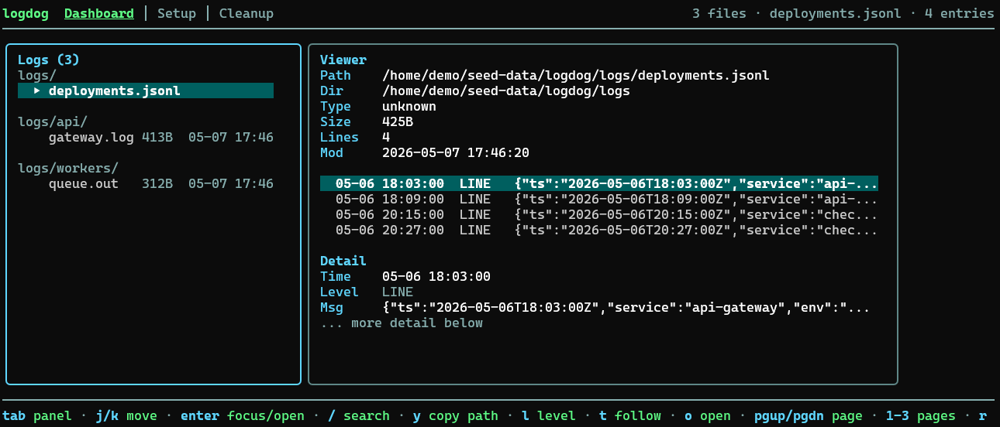

# logdog

Logging control plane for terminal projects. `logdog` covers the everyday log workflow from one place: discover files, inspect them in a TUI, tail them live, grep them from the CLI, and bootstrap a basic Go logger when needed.



**Live demo:** [froesch.dev](https://froesch.dev)

## Release Status

Developed for WSL2/Linux first. Cross-platform testing and bug fixing for macOS and native Windows are still in progress.

Linux, WSL2, and macOS are the primary targets today. Windows binaries and installer entrypoints are available, but native Windows should still be treated as experimental.

## Install

Quick install:

```bash
curl -fsSL https://raw.githubusercontent.com/LFroesch/logdog/main/install.sh | bash
```

Experimental native Windows install:

```powershell
irm https://raw.githubusercontent.com/LFroesch/logdog/main/install.ps1 | iex
```

Direct installers: [`install.sh`](https://raw.githubusercontent.com/LFroesch/logdog/main/install.sh), [`install.ps1`](https://raw.githubusercontent.com/LFroesch/logdog/main/install.ps1)

If you cloned the repo already:

```powershell
./install.ps1
```

```bat
install.cmd
```

Other options:

```bash
go install github.com/LFroesch/logdog@latest
make install
```

Quick check:

```bash
logdog status
```

## Modes

- TUI when you run `logdog` in a terminal
- CLI commands for scripts and pipelines
- stdin filtering when you pipe log data into it
- Structured and plain-text log handling in the same tool

## TUI Pages

| Page | Purpose |
|------|---------|
| Dashboard | Browse discovered logs, entries, and metadata |
| Setup | Manage roots, config, and Go logger install |
| Cleanup | Review and delete old log files safely |

## CLI

Common commands:

```bash
logdog
logdog status
logdog files
logdog cat
logdog cat /path/to/file.jsonl
logdog grep websocket
logdog tail
logdog tail /tmp/app.log
logdog prune --days 7
logdog config
logdog install
tail -f app.jsonl | logdog --level error --search timeout
```

Global filters:

- `--level`
- `--search`
- `--project`
- `--json`

`logdog cat` and `logdog tail` default to the latest discovered file when you do not pass an explicit path.

## Config

Config is created at `~/.config/logdog/logdog-config.json`.

Current working directory scanning is always on. Config adds more discovery roots and tuning:

```json
{
  "roots": ["~/.local/share/logdog"],
  "ignore_patterns": [".git", "node_modules", "vendor", "dist", "build"],
  "extensions": [".log", ".txt", ".out", ".json", ".jsonl", ".ndjson"],
  "cleanup_keep_days": 14
}
```

## Go Logger Install

Inside a Go project:

```bash
logdog install
```

That generates `internal/logdog/` and writes JSON Lines logs under:

```text
~/.local/share/logdog/<project>/logs/
```

The installed logger writes one file per logger name per day.

## Controls

| Key | Action |
|-----|--------|
| `1/2/3` | Dashboard, Setup, Cleanup |
| `tab` | Switch pane |
| `j/k` | Move |
| `/` | Search selected log |
| `l` | Cycle level filter |
| `t` | Toggle live follow |
| `o` | Open selected file or config |
| `space` | Select cleanup candidate |
| `x`, `D`, `X` | Delete current, selected, or prune by age |
| `r` | Reload discovery and config |
| `?` | Help |
| `q` | Quit |

## License

[AGPL-3.0](LICENSE)
